# Transcriptional Response of Nasal Mucosal Macrophages to Influenza A Virus Infection: A Single-Cell RNA-seq Analysis
Arwa Sheheryar  
BINF6110 – Assignment 4

---

## Introduction

Influenza A Virus (IAV) infection of the upper respiratory tract triggers a coordinated innate immune response in the nasal mucosa, a site of initial viral replication that encompasses anatomically and functionally distinct compartments: the respiratory mucosa (RM), olfactory mucosa (OM), and lateral nasal gland (LNG) (Kazer et al., 2024). The nasal mucosa is not merely a passive barrier but an active immunological interface, with resident macrophages serving as primary sentinels that detect viral RNA through pattern recognition receptors and initiate the antiviral type I interferon (IFN) response (Iwasaki & Pillai, 2014). Understanding the temporal and cell-type-specific dynamics of this response is essential for characterizing the early immunological events that determine infection outcome and potential viral spread to the olfactory system.

Single-cell RNA sequencing (scRNA-seq) is uniquely suited to dissecting the cellular heterogeneity of complex tissues such as the nasal mucosa, where diverse cell types — including neurons, glandular epithelial cells, immune cells, and structural cells — coexist and respond differentially to infection (Heumos et al., 2023). Unlike bulk RNA-seq, which averages gene expression across all cells in a sample and obscures rare or transient transcriptional states, scRNA-seq enables simultaneous profiling of thousands of individual cells, allowing cell-type-specific differential expression analysis, identification of novel cell states, and characterization of cellular composition changes across conditions (Heumos et al., 2023). This resolution is particularly important for studying immune responses to IAV, where macrophage activation states shift rapidly and heterogeneously across the course of infection (Guo et al., 2020).

Several methodological choices were made to balance analytical rigor with computational feasibility. Normalization was performed using log-normalization rather than SCTransform (Hafemeister & Satija, 2019), which uses regularized negative binomial regression and outperforms log-normalization for datasets with strong technical variation but is substantially more memory-intensive — infeasible here given the 149,125-cell dataset and 16 GB RAM constraint. Cluster annotation was performed manually rather than using automated tools such as SingleR (Aran et al., 2019), which assigns labels by correlating expression profiles against curated reference datasets. While SingleR reduces subjectivity, no curated single-cell reference exists for the specific combination of nasal compartments profiled here, making manual annotation based on established marker genes more appropriate (Kazer et al., 2024). Integration was considered but omitted after confirming that timepoints were thoroughly intermixed across clusters, indicating that clustering reflected biological rather than technical structure; integration tools such as Harmony (Korsunsky et al., 2019) are only warranted when cells cluster by sample rather than cell type (Stuart et al., 2019). Differential expression was performed using pseudobulk DESeq2 rather than single-cell methods such as MAST (Finak et al., 2015), which treats individual cells as independent replicates and has been shown to substantially inflate false positive rates in multi-sample experiments (Squair et al., 2021). Finally, over-representation analysis (ORA) was selected over GSEA because ORA directly tests the significance of a threshold-defined gene set, which is well-suited to pseudobulk DE results with n=3 replicates, whereas GSEA's ranking approach is more appropriate for larger sample sizes where gene-level statistics are more stable (Reimand et al., 2019).

This study reanalyses publicly available single-cell RNA-seq data from Kazer et al. (2024), which generated a longitudinal scRNA-seq atlas of the murine nasal mucosa across three tissue regions and five timepoints during primary IAV infection. A pre-built Seurat object containing count data and metadata was provided by the course instructor. The primary biological question addressed here is how macrophages respond transcriptionally at peak viral load (D05) compared to uninfected controls (Naive), and which innate immune pathways are activated during this window of maximal viral replication.

---

## Methods

### Data Loading and Inspection

A pre-built Seurat object containing scRNA-seq data from Kazer et al. (2024) was loaded directly into R v4.5.1 using `readRDS()`. The object comprised 156,572 cells across 25,129 features. Metadata columns encoding tissue type (`organ_custom`: OM, RM, LNG), timepoint (`time`: Naive, D02, D05, D08, D14), individual mouse identity (`mouse_id`; n=3 per group), and combined sample identity (`biosample_id`) were confirmed prior to analysis. All analysis was performed in R v4.5.1 using Seurat v5.

### Quality Control and Filtering

Mitochondrial gene content was calculated using `PercentageFeatureSet()` with the pattern `^mt-`, reflecting the lowercase mitochondrial gene prefix of the mouse genome (Mus musculus), as opposed to the uppercase `MT-` prefix used in human datasets. Cells were retained if they expressed more than 200 features (`nFeature_RNA > 200`), removing likely empty droplets and debris, and had mitochondrial content below 10% (`percent.mt < 10`), removing dying or damaged cells whose cytoplasmic RNA had leaked leaving a disproportionate mitochondrial fraction (Luecken & Theis, 2019). The upper threshold of 10% was selected based on visual inspection of violin plots, which showed that the vast majority of cells fell below 5% mitochondrial content, with a minor tail extending to ~16%; a threshold of 10% conservatively removed outliers while retaining high-quality cells. After filtering, 149,125 cells were retained for downstream analysis.

### Normalization, Feature Selection, and Dimensionality Reduction

Counts were normalized using log-normalization (`NormalizeData()`, normalization.method = "LogNormalize"), which scales each cell's counts by total counts per cell, multiplies by a scaling factor of 10,000, and applies a log1p transformation. This approach corrects for sequencing depth differences across cells and is the standard approach for downstream Seurat-based clustering workflows (Stuart et al., 2019). The 2,000 most highly variable features were identified using variance-stabilizing transformation (`FindVariableFeatures()`, selection.method = "vst", nfeatures = 2000), which models the mean-variance relationship across genes and selects those with the highest residual variance, prioritizing biologically informative genes while excluding constitutively expressed housekeeping genes (Stuart et al., 2019). Data were scaled across variable features using `ScaleData()`. Due to the large dataset size (149,125 cells) exceeding available system memory (16 GB RAM), scaling was restricted to variable features rather than all genes; this does not affect PCA or clustering results, as only variable features are used for dimensionality reduction, though it limits visualization of non-variable genes in heatmaps.

Principal component analysis (PCA) was performed on variable features (`RunPCA()`, npcs = 30). An elbow plot was generated to select the number of PCs for downstream clustering; the standard deviation curve showed a gradual plateau beginning around PC 20, consistent with the biological complexity expected from a multi-tissue, multi-timepoint dataset. Twenty PCs were therefore used for neighbor graph construction and UMAP embedding.

### Clustering and Batch Effect Assessment

A shared nearest neighbor (SNN) graph was constructed using `FindNeighbors()` (dims = 1:20), and clusters were identified using the Louvain algorithm (`FindClusters()`, resolution = 0.5), yielding 39 clusters. UMAP dimensionality reduction was performed using `RunUMAP()` (dims = 1:20) for visualization. To assess potential batch effects, UMAP plots were generated coloured by `time` and `organ_custom`. Timepoints were thoroughly intermixed across all clusters, indicating no batch effect by time. Tissue type showed expected biological separation in some regions — for example, olfactory mucosa cells were enriched in neuronal clusters — reflecting genuine biological differences in cell type composition between tissues rather than technical artifacts. Integration was therefore not performed, consistent with the recommendation to integrate only when cells cluster by sample rather than cell type (Stuart et al., 2019).

### Cluster Annotation

Marker genes for each cluster were identified using `FindAllMarkers()` (only.pos = TRUE, min.pct = 0.25, logfc.threshold = 0.25), which tests each cluster against all remaining cells using the Wilcoxon rank-sum test. This approach is appropriate for annotation purposes, as the goal is to identify cluster-defining markers rather than perform cross-condition differential expression, for which pseudobulk methods are preferred (Heumos et al., 2023). The top five marker genes per cluster ranked by average log2 fold change were examined and cross-referenced with established cell type markers for the nasal mucosa. Manual annotation was performed by comparing top markers to known cell type signatures: for example, clusters enriched for `Fcrls`, `Trem2`, and `Mrc1` were annotated as Microglia/Macrophages; clusters expressing `Ptprb`, `Emcn`, and `Sox18` as Endothelial cells; clusters expressing `Neurog1` and `Neurod1` as Neuronal progenitors; and clusters expressing `Omp` and `Cartpt` as Mature olfactory sensory neurons, consistent with published nasal cell atlases (Kazer et al., 2024). Clusters were renamed using `RenameIdents()`.

Feature plots were generated for canonical markers spanning immune (`Ptprc`, `Cd3e`, `Cd19`, `Lyz2`), structural (`Epcam`, `Pecam1`, `Col1a1`, `Acta2`), and olfactory (`Omp`, `Gap43`, `Sox2`, `Ascl1`) cell categories to validate annotations spatially on the UMAP.

### Pseudobulk Differential Expression Analysis

Differential expression between Naive and D05 macrophages was performed using a pseudobulk approach with DESeq2, following the recommendation of Heumos et al. (2023) and the course tutorial (Kang et al., 2018) that individual-cell statistics inflate false positive rates by treating cells as independent replicates. Pseudobulk analysis instead aggregates counts per cell type per biological replicate, producing sample-level count matrices that satisfy the independence assumptions of standard bulk RNA-seq models.

A combined `celltype.time` metadata column was created by pasting cell type identity and timepoint, and cells belonging to Naive and D05 macrophage groups were subsetted. Counts were aggregated by `time`, `mouse_id`, and `celltype.time` using `AggregateExpression()` (assays = "RNA", return.seurat = TRUE), collapsing each of the three mice per condition into a single pseudobulk sample. `FindMarkers()` was then applied to the aggregated object with `test.use = "DESeq2"`, comparing D05 macrophages to Naive macrophages. A Benjamini-Hochberg adjusted p-value < 0.05 was used as the significance threshold. This pseudobulk DESeq2 approach has been shown to provide better-calibrated p-values and lower false discovery rates than single-cell Wilcoxon tests in multi-sample scRNA-seq experiments (Squair et al., 2021).

### Over-Representation Analysis

Over-representation analysis (ORA) was performed using clusterProfiler v4.16.0 (Yu et al., 2012) with the mouse annotation database org.Mm.eg.db v3.22.0. Gene symbols from the DE results were mapped to Entrez Gene IDs using `bitr()` (fromType = "SYMBOL", toType = "ENTREZID"); 9.54% of input IDs failed to map and were excluded. Upregulated significant genes (p_val_adj < 0.05, avg_log2FC > 0) were tested for enrichment against a background of all genes tested in the DE analysis. GO Biological Process enrichment was performed using `enrichGO()` (ont = "BP", pAdjustMethod = "BH", pvalueCutoff = 0.05, qvalueCutoff = 0.2, readable = TRUE). KEGG pathway enrichment was performed using `enrichKEGG()` (organism = "mmu", pvalueCutoff = 0.05, qvalueCutoff = 0.2). Results were visualized using dotplots, barplots, and enrichment map plots from the enrichplot package. ORA was selected over GSEA because the pseudobulk DE analysis with n=3 replicates per group provides a clearly defined significant gene set, and ORA directly tests the biological relevance of this threshold-defined list (Reimand et al., 2019). All analysis code is available in the project repository at https://github.com/arwasheheryar/6110A4.

---

## Results

### Data Quality and Cell Type Landscape

Quality control filtering removed 7,447 low-quality cells (4.75% of the total), retaining 149,125 cells for analysis. The post-filtering violin plots confirmed successful removal of cells with extreme mitochondrial content and very low feature counts, with the retained population showing a consistent median of approximately 1,000 features per cell and mitochondrial content below 5% across all five timepoints.

Unsupervised clustering at resolution 0.5 identified 39 distinct clusters, which were visualized on a UMAP embedding (Figure 1). The UMAP revealed clear transcriptional separation between broad biological compartments: a large contiguous region on the right side of the embedding corresponding to immune and epithelial cells, a distinct arch-shaped region containing olfactory sensory neurons and their progenitors, and smaller isolated clusters representing rare cell types including osteoblasts, chondrocytes, and Schwann cells. Colour-coding the UMAP by timepoint confirmed that all five timepoints were thoroughly intermixed across clusters (Figure 2), indicating that cells were clustering by cell type rather than by sequencing batch or sample identity. Colour-coding by tissue revealed expected biological differences: olfactory mucosa (OM) cells were enriched in neuronal clusters, while lateral nasal gland (LNG) cells were predominant in secretory gland clusters (Figure 3), reflecting genuine tissue-specific cell type compositions consistent with the known anatomy of the nasal cavity (Kazer et al., 2024). Integration was therefore not performed.

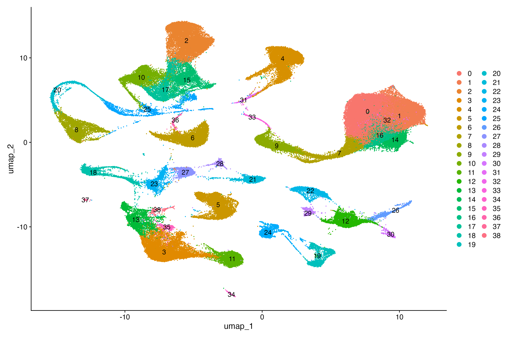

**Figure 1.** UMAP of 149,125 nasal mucosa cells coloured by unsupervised cluster identity. Thirty-nine clusters were identified at resolution 0.5 using the Louvain algorithm on a shared nearest neighbor graph constructed from 20 principal components.

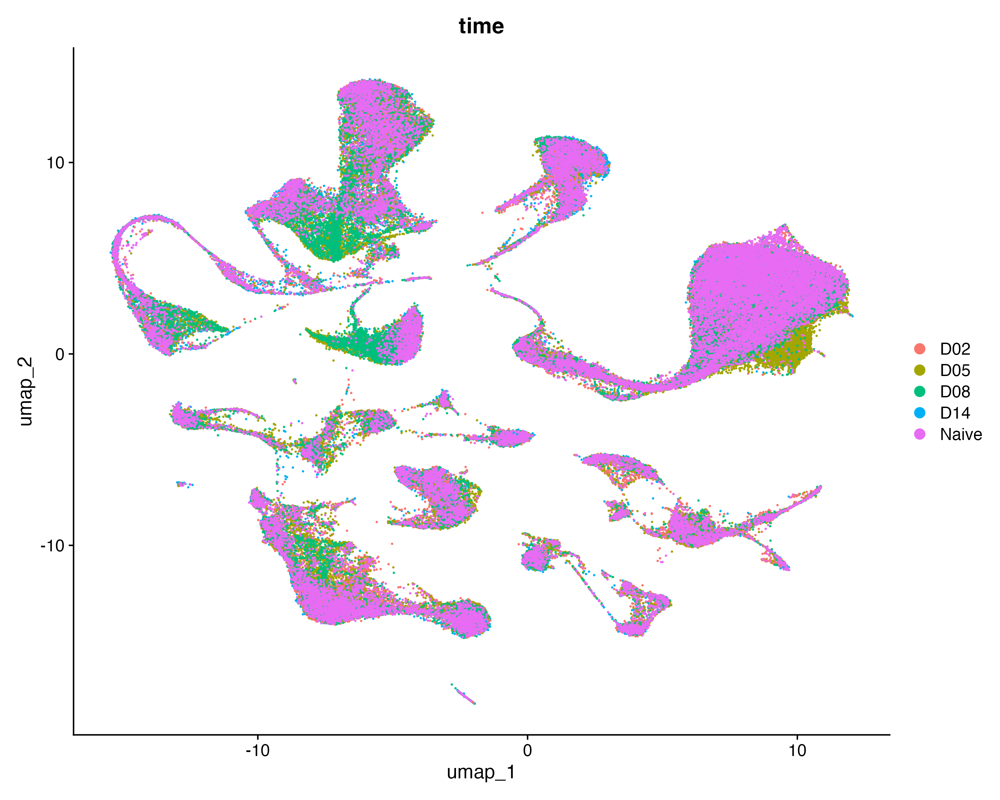

**Figure 2.** UMAP coloured by timepoint (Naive, D02, D05, D08, D14). All timepoints are intermixed across clusters, indicating no batch effect by infection timepoint.

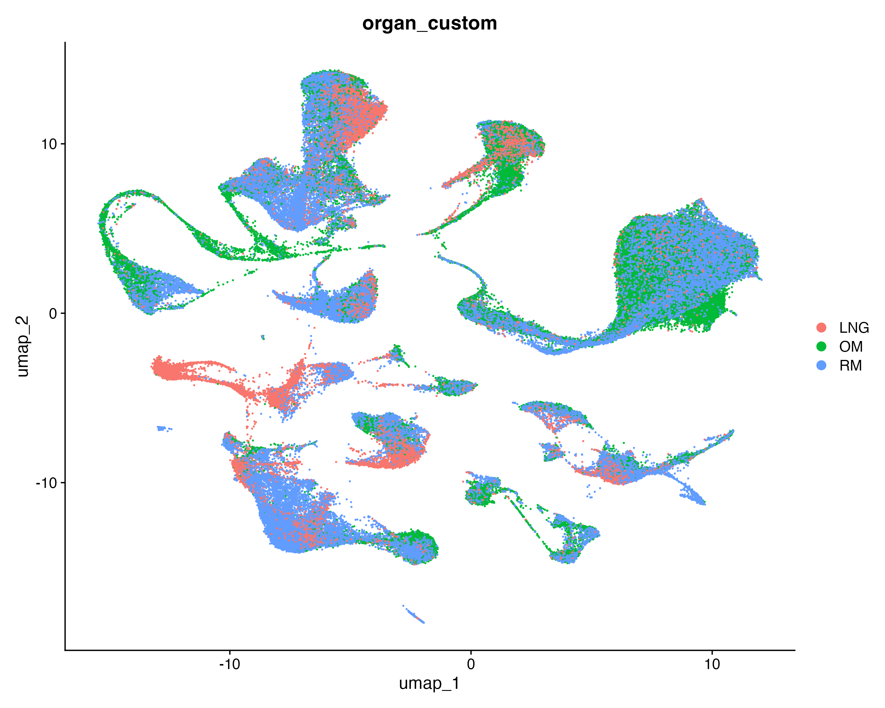

**Figure 3.** UMAP coloured by tissue of origin (OM = olfactory mucosa, RM = respiratory mucosa, LNG = lateral nasal gland). Tissue-specific enrichment in certain clusters reflects genuine biological differences in cell type composition between compartments.

Manual annotation of the 39 clusters identified a comprehensive representation of nasal tissue cell types (Figure 4), including multiple subtypes of olfactory sensory neurons (Mature OSNs, Olfactory sensory neurons, Neuronal progenitors), diverse immune populations (Microglia/Macrophages, IFN-stimulated macrophages, Neutrophils, NK cells, B cells, Dendritic cells, Cytotoxic T cells), structural cells (Fibroblasts, Endothelial cells, Smooth muscle/Pericytes, Schwann cells), and specialized epithelial and glandular cells (Sustentacular cells, Goblet cells, Tuft cells, Ionocytes, LNG secretory cells, Serous gland cells). Feature plots of canonical markers confirmed the spatial accuracy of annotations: *Ptprc* (CD45) marked immune clusters on the left side of the embedding; *Lyz2* highlighted myeloid populations; *Omp* expression was concentrated in the large mature OSN cluster on the right; *Gap43* marked the connecting ribbon of immature neurons; and *Sox2* highlighted sustentacular and progenitor populations in the bottom-left region (Figures 5–7).

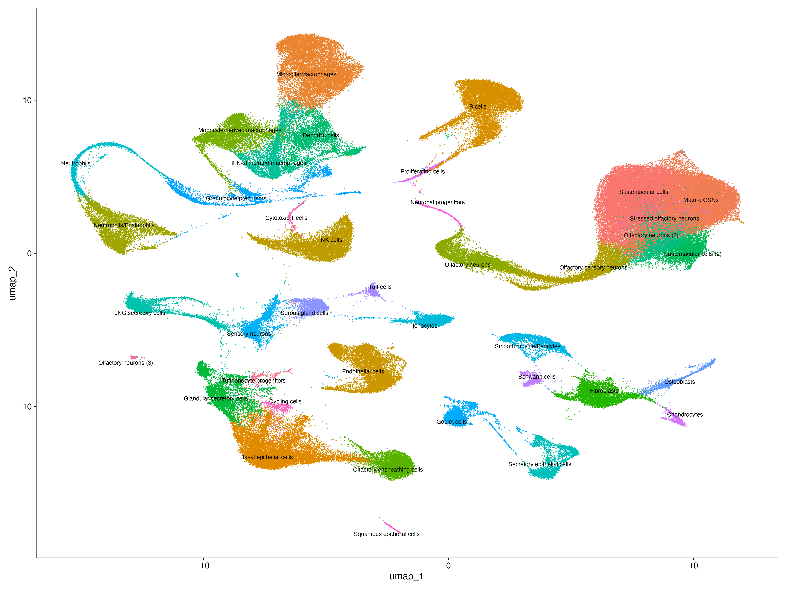

**Figure 4.** Annotated UMAP with cell type labels assigned by manual annotation based on top marker genes per cluster identified by `FindAllMarkers()`. Thirty-nine clusters were annotated into biologically meaningful cell type labels.

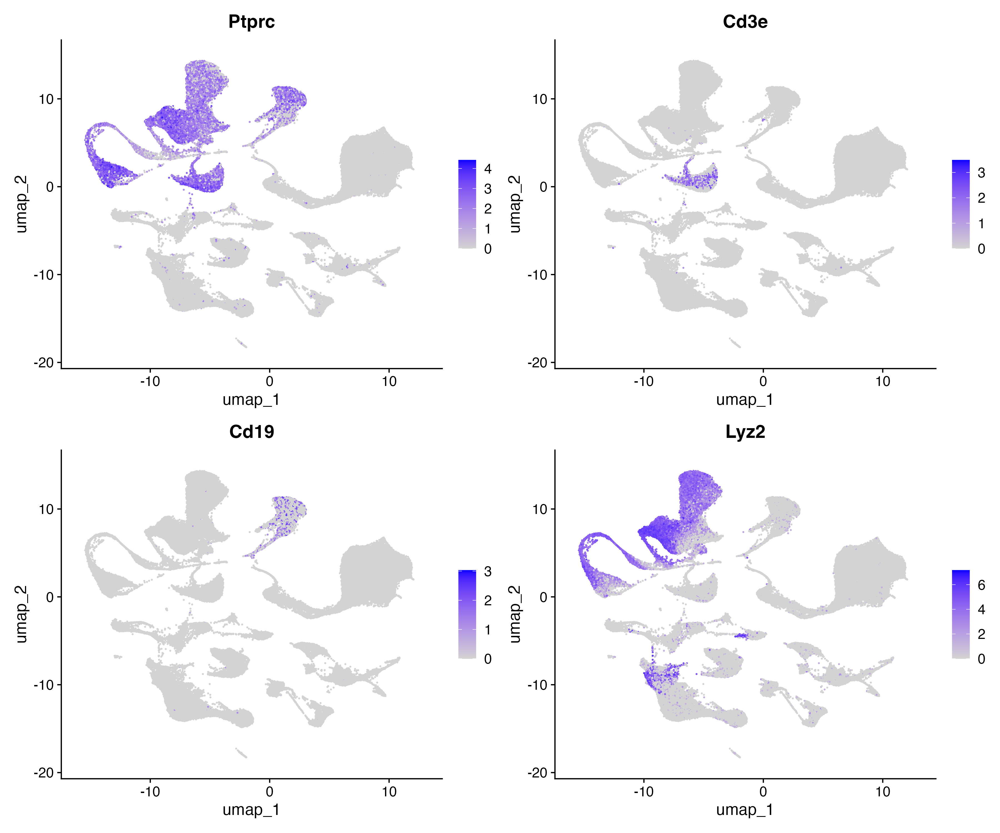

**Figure 5.** Feature plots of canonical immune cell markers. *Ptprc* (CD45) marks all immune cells; *Cd3e* marks T cells; *Cd19* marks B cells; *Lyz2* marks myeloid cells.

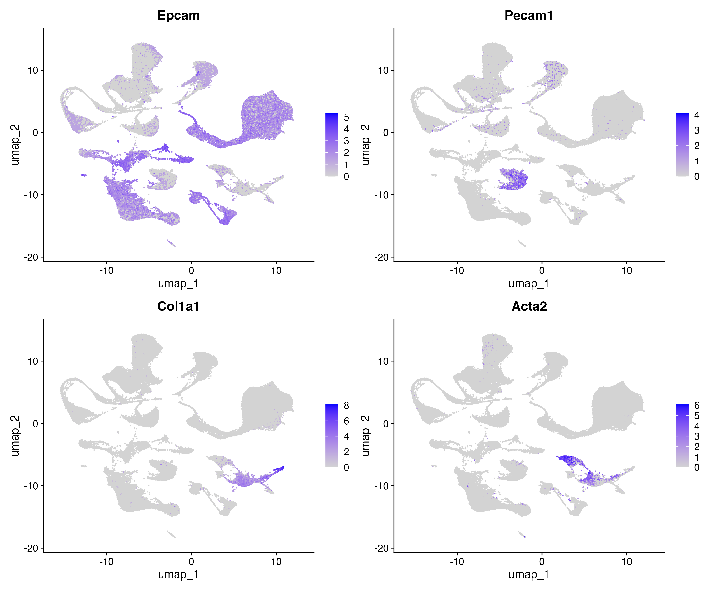

**Figure 6.** Feature plots of structural cell markers. *Epcam* marks epithelial cells; *Pecam1* marks endothelial cells; *Col1a1* marks fibroblasts; *Acta2* marks smooth muscle cells and pericytes.

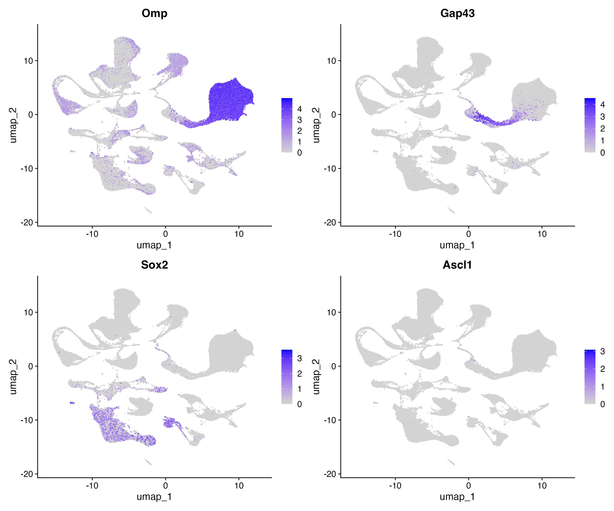

**Figure 7.** Feature plots of olfactory cell markers. *Omp* marks mature olfactory sensory neurons; *Gap43* marks immature/transitioning neurons; *Sox2* marks sustentacular and progenitor cells; *Ascl1* marks neuronal progenitors.

### Differential Expression in Macrophages at Peak Viral Load

Pseudobulk DESeq2 analysis comparing macrophages at D05 (peak viral load) to Naive macrophages identified differentially expressed genes at p_val_adj < 0.05. The top 15 upregulated genes are shown in Table 1, including *Zbp1* (avg_log2FC = 1.54), *Gm42418* (avg_log2FC = 1.82), *Rsad2* (avg_log2FC = 1.42), *Stmn1* (avg_log2FC = 1.59), *Ifih1* (avg_log2FC = 1.08), and *Xaf1* (avg_log2FC = 1.17) — a coherent set of interferon-stimulated genes (ISGs) and innate antiviral sensors. Violin plots of the top upregulated genes confirmed higher expression at D05 relative to Naive within the macrophage population, with *Gm42418* and *Isg15* showing the most pronounced differences (Figure 8).

**Table 1.** Top 15 differentially expressed genes in macrophages at D05 vs Naive (pseudobulk DESeq2, ranked by adjusted p-value). pct.1 = fraction of D05 macrophages expressing the gene; pct.2 = fraction of Naive macrophages expressing the gene.

| Gene | avg_log2FC | pct.1 | pct.2 | p_val_adj |
|------|-----------|-------|-------|-----------|
| Arl6ip5 | 1.26 | 1.0 | 0.9 | 1.61 × 10⁻¹⁴ |
| Stmn1 | 1.59 | 1.0 | 0.9 | 1.19 × 10⁻¹¹ |
| Gm15655 | 1.28 | 0.9 | 0.9 | 1.41 × 10⁻⁹ |
| Zbp1 | 1.54 | 1.0 | 0.9 | 1.58 × 10⁻⁸ |
| Lgals3bp | 1.02 | 1.0 | 0.9 | 6.90 × 10⁻⁸ |
| Parp14 | 0.30 | 1.0 | 1.0 | 1.06 × 10⁻⁶ |
| Slfn8 | 0.93 | 1.0 | 0.9 | 1.87 × 10⁻⁶ |
| Gm42418 | 1.82 | 1.0 | 1.0 | 1.13 × 10⁻⁵ |
| Dgkz | 0.97 | 1.0 | 0.9 | 2.02 × 10⁻⁵ |
| Xaf1 | 1.17 | 1.0 | 0.9 | 2.15 × 10⁻⁵ |
| Plekho1 | 0.76 | 1.0 | 0.9 | 9.30 × 10⁻⁵ |
| Ifih1 | 1.08 | 1.0 | 0.9 | 1.16 × 10⁻⁴ |
| Ifi211 | 1.04 | 0.9 | 0.9 | 1.38 × 10⁻⁴ |
| Rsad2 | 1.42 | 1.0 | 0.9 | 2.22 × 10⁻⁴ |
| Gm4070 | 1.04 | 1.0 | 0.9 | 2.52 × 10⁻⁴ |

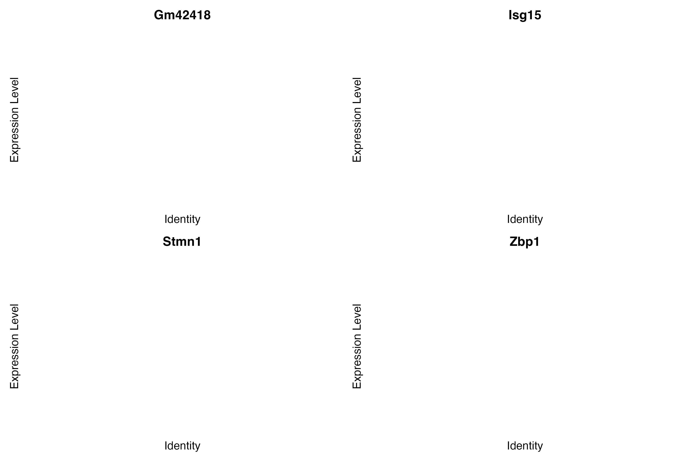

**Figure 8.** Violin plots of selected top upregulated genes confirmed higher expression at D05 relative to Naive within the macrophage population. 

### Pathway Enrichment in D05 Macrophages

ORA of upregulated genes in D05 macrophages revealed strong and statistically significant enrichment of antiviral immune response pathways (Figures 9–11). The most significantly enriched GO Biological Process terms included "response to virus" (GeneRatio = 0.42, p_adj < 5 × 10⁻⁸), "defense response to virus" (GeneRatio = 0.39, p_adj < 5 × 10⁻⁸), "regulation of viral process", and "regulation of innate immune response", all sharing high gene ratios and the most significant adjusted p-values (Figure 9). The enrichment map plot revealed that these terms form a tightly connected cluster reflecting shared gene membership through core ISGs including *Stat1*, *Irf7*, *Isg15*, *Rsad2*, *Ifih1*, and *Zbp1* (Figure 10). KEGG pathway analysis identified "Influenza A" (mmu05164) as the second most significantly enriched pathway (GeneRatio = 0.36, p_adj = 4.28 × 10⁻⁵), driven by *Eif2ak2*, *Ifih1*, *Irf7*, *Rsad2*, and *Stat1* — all well-established components of the cellular response to IAV specifically (Figure 11). Additional significantly enriched KEGG pathways included "RIG-I-like receptor signaling pathway", "Cytosolic DNA-sensing pathway", and "Toll-like receptor signaling pathway", reflecting broad activation of multiple innate immune sensing cascades in macrophages at peak viral load.

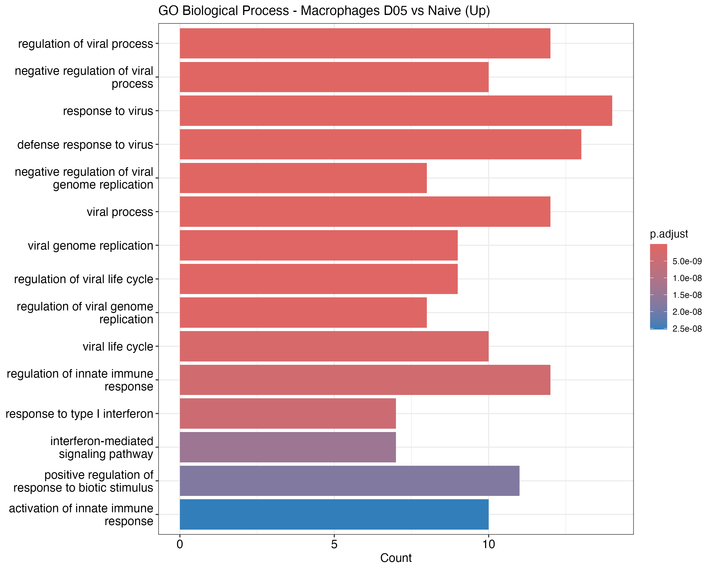

**Figure 9.** GO Biological Process barplot of over-represented terms in upregulated macrophage genes at D05 vs Naive. Bar length indicates gene count; colour indicates adjusted p-value.

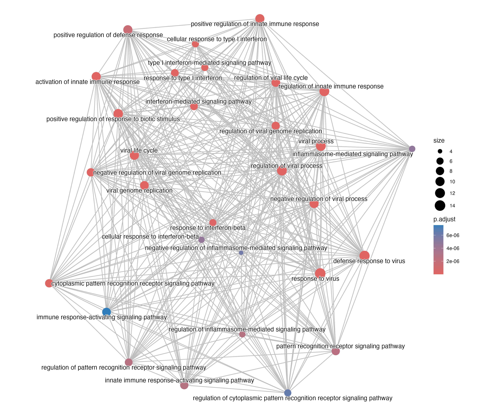

**Figure 10.** Enrichment map of significantly enriched GO Biological Process terms. Connected nodes share gene members; node colour indicates adjusted p-value. The dense cluster of antiviral and interferon-related terms reflects shared ISG gene membership.

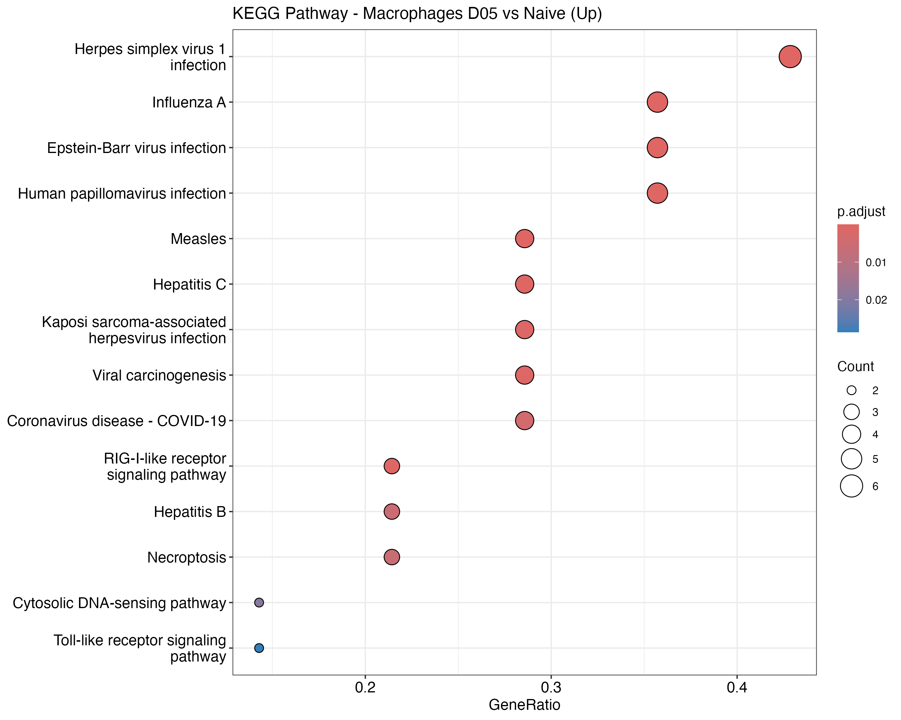

**Figure 11.** KEGG pathway dotplot of over-represented pathways in upregulated macrophage genes at D05 vs Naive. Dot size indicates gene count; colour indicates adjusted p-value. The Influenza A pathway is specifically enriched, validating the biological relevance of the identified gene set.

---

## Discussion

The results of this analysis demonstrate that nasal mucosal macrophages mount a robust and highly specific antiviral transcriptional response at peak IAV viral load (D05), characterized by coordinated upregulation of interferon-stimulated genes, innate immune sensors, and antiviral effector molecules. The coherence of this response — with ISGs including *Stat1*, *Isg15*, *Rsad2*, *Ifih1*, and *Zbp1* forming the core of both the DE results and the enriched GO and KEGG pathways — indicates that type I IFN signaling is the dominant transcriptional program activated in macrophages during this window of infection.

The upregulation of *Zbp1* is particularly noteworthy in the context of IAV infection. Zbp1 was originally identified as a Z-form nucleic acid sensor and was subsequently shown to be a critical mediator of IAV-induced cell death through its Z-RNA sensing activity (Zhang et al., 2020). IAV genomic RNA adopts a Z-form conformation during replication, which is detected by Zbp1's Zα domains, triggering RIPK3-MLKL-mediated necroptosis and RIPK3-caspase-8-mediated apoptosis (Thapa et al., 2016; Zhang et al., 2020). This programmed inflammatory cell death in macrophages contributes to both viral clearance and, if dysregulated, to immunopathology. The strong induction of *Zbp1* at D05 — coinciding with peak viral replication — positions nasal macrophages as a key site of this sensor-dependent antiviral response in the upper respiratory tract, consistent with the enrichment of the "Necroptosis" KEGG pathway observed in Figure 11.

The identification of *Rsad2* (Viperin) among the top upregulated genes is consistent with its established role as a broad-spectrum antiviral ISG. Viperin has been shown to restrict IAV replication by converting CTP to 3′-deoxy-3′,4′-didehydro-CTP (ddhCTP), a chain-terminating antiviral nucleotide that inhibits the viral RNA polymerase (Gizzi et al., 2018). Its induction in nasal macrophages at D05 suggests that macrophages contribute not only to immune signaling but also to direct antiviral effector activity at the site of primary infection, a function that has been increasingly recognized in tissue-resident macrophage populations (Guo et al., 2020).

The enrichment of the KEGG "Influenza A" pathway specifically — rather than a generic viral response pathway — validates the biological specificity of the macrophage response captured in this analysis. This pathway includes both the IFN induction arm (via *Ifih1* and *Irf7*) and effector components (*Rsad2*, *Stat1*, *Eif2ak2*), consistent with the dual role of macrophages in both sensing and restricting IAV. The concurrent enrichment of "RIG-I-like receptor signaling", "Toll-like receptor signaling", and "Cytosolic DNA-sensing" pathways suggests that multiple pattern recognition receptor pathways are activated simultaneously, reflecting the redundant innate immune sensing architecture that has been described during IAV infection (Iwasaki & Pillai, 2014). The enrichment map in Figure 10 further illustrates the interconnected nature of these pathways, with "type I interferon-mediated signaling pathway", "cellular response to type I interferon", and "interferon-mediated signaling pathway" forming a distinct subcluster connected to the broader antiviral response network.

An important consideration in interpreting these results is that the pseudobulk analysis used only n=3 mice per condition, which is the minimum recommended for DESeq2-based pseudobulk analysis (Squair et al., 2021). While the DE results are statistically robust — with many genes reaching adjusted p-values well below 0.05 — the limited sample size reduces power to detect smaller effect sizes and increases sensitivity to individual animal variation. Additionally, the macrophage cluster analyzed here (cluster 2) represents a mixture of tissue-resident macrophages from RM, OM, and LNG, and tissue-specific macrophage responses may differ. Future analyses could subset macrophages by `organ_custom` to resolve these tissue-specific differences, or employ trajectory analysis (e.g., Monocle3) to characterize macrophage activation dynamics across the five timepoints.

The broader cell type landscape identified in this dataset also highlights several biologically interesting observations beyond the macrophage analysis. The presence of a distinct "IFN-stimulated macrophages" cluster (cluster 17, marked by *Ifi205*, *Cxcl9*, and *Cfb*) that is separate from the primary macrophage cluster suggests that a subset of macrophages undergoes a more extreme IFN-driven transcriptional shift during infection, potentially representing a distinct activation state (Guo et al., 2020). The "Stressed olfactory neurons" cluster (cluster 32, marked by *Chac1*) is also of biological interest: *Chac1* encodes a glutathione-degrading enzyme induced by oxidative stress and endoplasmic reticulum stress, and its expression in olfactory neurons during IAV infection may reflect neuronal stress responses to the inflammatory milieu established by the innate immune response (Mungrue et al., 2009).

Overall, this analysis demonstrates that nasal mucosal macrophages are transcriptionally active innate immune effectors at the site of IAV replication, deploying a coordinated ISG programme centered on IFN signaling, viral RNA sensing via multiple PRR pathways, and direct antiviral effector activity at peak viral load. These findings are consistent with the established role of type I IFN and its downstream effectors in controlling early IAV replication and highlight the nasal mucosa as an active immunological interface rather than a passive conduit for viral infection.

---

## References

Aran, D., Looney, A. P., Liu, L., et al. (2019). Reference-based analysis of lung single-cell sequencing reveals a transitional profibrotic macrophage. *Nature Immunology*, 20(2), 163–172. https://doi.org/10.1038/s41590-018-0276-y

Finak, G., McDavid, A., Yajima, M., et al. (2015). MAST: a flexible statistical framework for assessing transcriptional changes and characterizing heterogeneity in single-cell RNA sequencing data. *Genome Biology*, 16, 278. https://doi.org/10.1186/s13059-015-0844-5

Gizzi, A. S., Grove, T. L., Arnold, J. J., et al. (2018). A naturally occurring antiviral ribonucleotide encoded by the human genome. *Nature*, 558(7711), 610–614. https://doi.org/10.1038/s41586-018-0238-4

Guo, X. J., & Thomas, P. G. (2020). New fronts emerge in the influenza cytokine storm. *Seminars in Immunopathology*, 42(1), 57–73. https://doi.org/10.1007/s00281-019-00764-3

Hafemeister, C., & Satija, R. (2019). Normalization and variance stabilization of single-cell RNA-seq data using regularized negative binomial regression. *Genome Biology*, 20, 296. https://doi.org/10.1186/s13059-019-1874-1

Heumos, L., Schaar, A. C., Lance, C., et al. (2023). Best practices for single-cell analysis across modalities. *Nature Reviews Genetics*, 24(8), 550–572. https://doi.org/10.1038/s41576-023-00586-w

Iwasaki, A., & Pillai, P. S. (2014). Innate immunity to influenza virus infection. *Nature Reviews Immunology*, 14(5), 315–328. https://doi.org/10.1038/nri3665

Kazer, S. W., Matysiak Match, C., Langan, E. M., et al. (2024). Primary nasal influenza infection rewires tissue-scale memory response dynamics. *Immunity*, 57(8), 1955–1974. https://doi.org/10.1016/j.immuni.2024.06.005

Kang, H. M., Subramaniam, M., Targ, S., et al. (2018). Multiplexed droplet single-cell RNA-sequencing using natural genetic variation. *Nature Biotechnology*, 36(1), 89–94. https://doi.org/10.1038/nbt.4042

Korsunsky, I., Millard, N., Fan, J., et al. (2019). Fast, sensitive and accurate integration of single-cell data with Harmony. *Nature Methods*, 16(12), 1289–1296. https://doi.org/10.1038/s41592-019-0619-0

Love, M. I., Huber, W., & Anders, S. (2014). Moderated estimation of fold change and dispersion for RNA-seq data with DESeq2. *Genome Biology*, 15(12), 550. https://doi.org/10.1186/s13059-014-0550-8

Luecken, M. D., & Theis, F. J. (2019). Current best practices in single-cell RNA-seq analysis: a tutorial. *Molecular Systems Biology*, 15(6), e8746. https://doi.org/10.15252/msb.20188746

Mungrue, I. N., Pagnon, J., Kohannim, O., Gargalovic, P. S., & Lusis, A. J. (2009). CHAC1/MGC4504 is a novel proapoptotic component of the unfolded protein response, downstream of the ATF4-ATF3-CHOP cascade. *Journal of Immunology*, 182(1), 466–476. https://doi.org/10.4049/jimmunol.182.1.466

Reimand, J., Isserlin, R., Voisin, V., et al. (2019). Pathway enrichment analysis and visualization of omics data using g:Profiler, GSEA, Cytoscape and EnrichmentMap. *Nature Protocols*, 14(2), 482–517. https://doi.org/10.1038/s41596-018-0103-9

Squair, J. W., Gautier, M., Kathe, C., et al. (2021). Confronting false discoveries in single-cell differential expression. *Nature Communications*, 12, 5692. https://doi.org/10.1038/s41467-021-25960-2

Stuart, T., Butler, A., Hoffman, P., et al. (2019). Comprehensive integration of single-cell data. *Cell*, 177(7), 1888–1902. https://doi.org/10.1016/j.cell.2019.05.031

Subramanian, A., Tamayo, P., Mootha, V. K., et al. (2005). Gene set enrichment analysis: a knowledge-based approach for interpreting genome-wide expression profiles. *Proceedings of the National Academy of Sciences*, 102(43), 15545–15550. https://doi.org/10.1073/pnas.0506580102

Thapa, R. J., Ingber, J., Shapiro, B., et al. (2016). DAI senses influenza A virus genomic RNA and activates RIPK3-dependent cell death. *Cell Host & Microbe*, 20(5), 674–681. https://doi.org/10.1016/j.chom.2016.09.014

Yu, G., Wang, L. G., Han, Y., & He, Q. Y. (2012). clusterProfiler: an R package for comparing biological themes among gene clusters. *OMICS*, 16(5), 284–287. https://doi.org/10.1089/omi.2011.0118

Zhang, T., Yin, C., Boyd, D. F., et al. (2020). Influenza virus Z-RNAs induce ZBP1-mediated necroptosis. *Cell*, 180(6), 1115–1129. https://doi.org/10.1016/j.cell.2020.02.050

